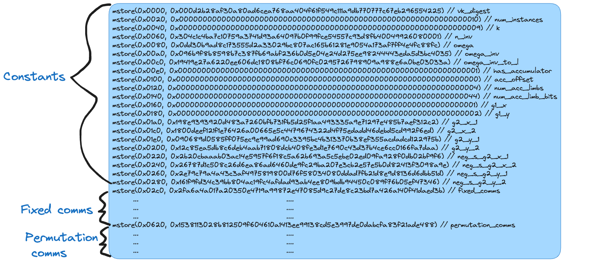
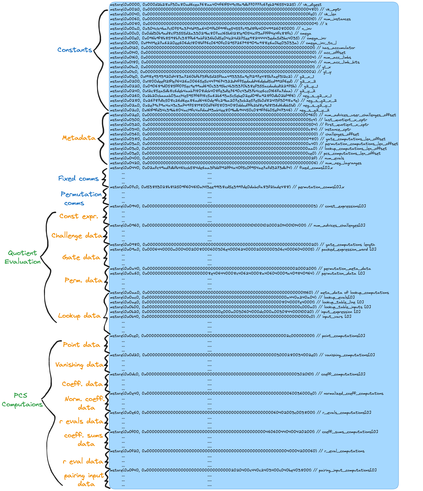
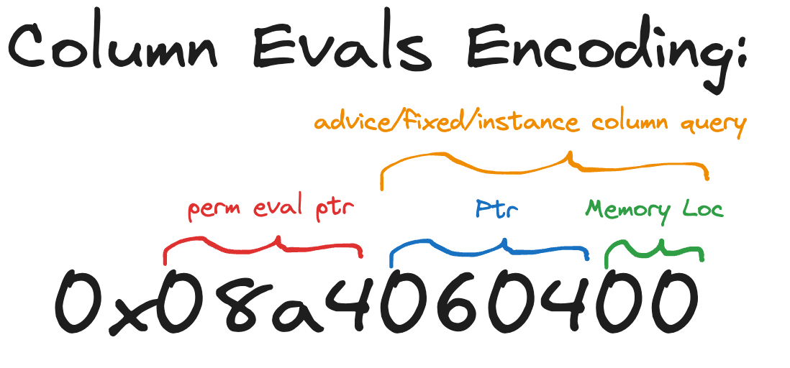

For background reading we highly recommend the [**Halo2 book](https://zcash.github.io/halo2/),** Patrick Colin’s EVM Assembly [course](https://www.youtube.com/watch?v=Y3WMkl0AFJk&t=91s) or the official [Yul documentation](https://docs.soliditylang.org/en/latest/yul.html).

## **The Problem with Previous Verifiers**

Previously, each unique circuit required a corresponding Solidity verifier, which hardcoded various circuit metadata directly into the contract. This approach meant that every time a new circuit was deployed for EVM usage, a new verifier contract had to be deployed as well, resulting in state bloat. 

The Solidity verifier depended on constants such as calldata pointers, memory pointers, and other computations (challenge generation, quotient evaluation and polynomial commitment scheme) that were hardcoded into the verifier. 

---

## **The New Reusable Verifier**

The new reusable verifier takes a different approach, one that abstracts the circuit-specific data away from the verifier contract itself. Instead of embedding metadata directly into the verifier, this information is now stored in a separate "VK artifact."

In the original compiler, there was an option to deploy the VK as a separate contract from the verifier. With this setup, you could pass a VK address as an argument to the `verifyProof` function and load the necessary code into memory during verification execution.

```solidity
function verifyProof(
    address vk,
    bytes calldata proof,
    uint256[] calldata instances
) public returns (bool) {
    // Verifier logic...
}
```

This architecture granted some degree of reusability as circuits with sufficiently similar configurations could now reuse the same verifier despite having different VKs.

We aimed to push the boundaries further by extending the separate VK to encompass all the necessary data for performing the non-reusable parts of the verifier computations, creating a VK artifact. Our challenge was not only to determine how to efficiently encode this data but also to decode it in such a way that the reusable verifier could execute the computations exactly as the original verifier contract would.

With this enhanced approach, the reusable verifier no longer needs to hardcode circuit-specific data. Instead, it dynamically loads the necessary information from the VK artifact at runtime. This allows the verifier to be sufficiently generic to handle any valid Halo2 circuit.

By caching all this data in the VK artifact and dynamically loading it into memory as needed, we achieve several significant benefits. Notably, there is a substantial reduction in state usage—up to 78% for large circuits—which translates into lower deployment costs. This cost reduction also enables us to deploy verifiers for circuits that were previously too large to fit within the [smart contract size limit](https://eips.ethereum.org/EIPS/eip-170) of **24,576** bytes. Previously, such large circuits required aggregation, which introduced additional latency to our ZKML execution pipeline. With the new reusable verifier, we can now deploy these circuits directly, reducing latency and improving overall user experience. 

However, this improvement does come with a trade-off: by dynamically loading circuit data that was previously hardcoded on the stack into memory, we introduce additional overhead at runtime. This results in a 14% increase in execution costs. Despite this, the trade-off is favorable for large circuits, where the 78% reduction in deployment costs and eliminating aggregation significantly outweighs the increase in execution costs.

As an auxiliary benefit, the singleton architecture makes indexing for deployed verifiers a much less painful task since all the verification TX will be routed through a single contract that can emit indexable events. 

---

## **Challenges and Technical Details**

Implementing this reusable verifier posed several challenges. There were four key components of the original verifier that needed to be re-engineered for reuse:

1. **Constants Management:** The original verifier contained numerous constants that were tightly coupled to specific memory and calldata pointers. In the new architecture, these constants are no longer hardcoded but are instead managed dynamically through the VK artifact.
2. **Challenge Generations:** The process of generating challenges was previously hardcoded and circuit-specific. In the reusable verifier, this process is generalized to work across different circuits, using metadata from the VK artifact.
3. **Quotient Evaluations:** Similarly, quotient evaluations, which were once hardcoded, are now performed in a more generic manner, making them adaptable to various circuit geometries and is composed of three different parts:
    1. Gate evaluations
    2. Permutation evaluations
    3. Lookup evaluations
4. **PCS (Polynomial Commitment Scheme) Computations:** These computations were perhaps the most complex to generalize, consisting of 7 different steps (based on the batch open scheme outlined in this [paper](https://eprint.iacr.org/2020/081.pdf)):
    1. point computations
    2. vanishing computations
    3. coefficient computations
    4. normalized coefficient computations
    5. r evals computations
    6. coefficient sums computation
    7. r eval computations
    8. pairing input computations

Our engineering approach here was to incrementally make each of these sub steps in the overall verification computation reusable, gradually removing fields that depended on the circuit data from the `Halo2Verifier` [askama template](https://djc.github.io/askama/askama.html) struct and migrating them over to the `Halo2VerifierArtifact`, starting from top to bottom: 

```rust
#[derive(Template)]
#[template(path = "Halo2Verifier.sol")]
pub(crate) struct Halo2Verifier {
    pub(crate) scheme: BatchOpenScheme,
    pub(crate) embedded_vk: Option<Halo2VerifyingKey>,
    pub(crate) vk_len: usize,
    pub(crate) proof_len: usize,
    pub(crate) vk_mptr: Ptr,
    pub(crate) challenge_mptr: Ptr,
    pub(crate) theta_mptr: Ptr,
    pub(crate) proof_cptr: Ptr,
    pub(crate) proof_len_cptr: Ptr,
    pub(crate) quotient_comm_cptr: Ptr,
    pub(crate) num_neg_lagranges: usize,
    pub(crate) num_advices: Vec<usize>,
    pub(crate) num_challenges: Vec<usize>,
    pub(crate) num_evals: usize,
    pub(crate) num_quotients: usize,
    pub(crate) quotient_eval_numer_computations: Vec<Vec<String>>,
    pub(crate) pcs_computations: Vec<Vec<String>>,
}
```

## Memory layout of VK and VK artifact

As mentioned previously, the VK artifact extends the VK. The sections labeled in yellow text in the diagrams below highlights the extensions made on the VK that compose the new artifact. 

### `Halo2VerifyingKey.sol` :



### `Halo2VerifyingArtifact.sol` :



Here is a brief description of each section:

1. **Metadata:** consists of three types of data
    1.  Globally used pointers that were otherwise hardcoded as constants in the verifier. 
        1. `last_quotient_x_cptr`
        2. `first_quotient_x_cptr`
        3. `instance_cptr`
        4. `challenge_offset` ⇒ used to generate `THETA_MPTR` == `vk_mptr + vk_len + challenge_offset`
    2. Length data for the terminating conditions of the non-circuit specific for-loops used in reading and computing the lagrange and instance evaluations.
        1. `num_evals`
        2. `num_neg_lagranges`
    3. Offset data for where in the VK artifact memory the `Challenge Generations`, ****`Quotient ****Evaluations` ****and `PCS` computations start. 
        1. `num_advices_user_challenges_offset` 
        2. `gate_computations_len_offset`
        3. `permutations_computations_len_offset`
        4. `lookup_computations_len_offset` 
        5. `pcs_computations_len_offset`
2. **Const expressions:** To understand this section, it's important to first discuss the `Expression<F>` data type and how it's evaluated during quotient evaluation.
    1. The gate and lookup computations in the verifier require evaluating `Expression<F>` enums, which are **algebraic expressions** that represent various elements and operations in a low-degree polynomial identity. One of the variants of this enum is `Constant`, which refers to a [field element](https://zcash.github.io/halo2/background/fields.html). We needed a mechanism to efficiently collect all these constants, store them in memory, and load them dynamically during their evaluation step.
    2. Previously, the evaluation of each expression was hardcoded as a series of intermediate computations directly onto the stack. However, to achieve reusability, we needed to transition from using [static stack locations](https://www.evm.codes/about#stack) to the [more flexible memory locations](https://www.evm.codes/about#memory), as these expressions are fully dependent on the given circuit configuration. 
    
    ```rust
    /// Low-degree expression representing an identity that must hold over the committed columns.
    #[derive(Clone, PartialEq, Eq)]
    pub enum Expression<F> {
        /// This is a constant polynomial
        Constant(F),
        /// This is a virtual selector
        Selector(Selector),
        /// This is a fixed column queried at a certain relative location
        Fixed(FixedQuery),
        /// This is an advice (witness) column queried at a certain relative location
        Advice(AdviceQuery),
        /// This is an instance (external) column queried at a certain relative location
        Instance(InstanceQuery),
        /// This is a challenge
        Challenge(Challenge),
        /// This is a negated polynomial
        Negated(Box<Expression<F>>),
        /// This is the sum of two polynomials
        Sum(Box<Expression<F>>, Box<Expression<F>>),
        /// This is the product of two polynomials
        Product(Box<Expression<F>>, Box<Expression<F>>),
        /// This is a scaled polynomial
        Scaled(Box<Expression<F>>, F),
    }
    ```
    
3. **Challenge Data:** Here we encode the `num_advices` and `num_challenges` needed in reading the instances, witness commitments and [generating challenges](https://hackmd.io/@axiom/SJw3p-qX3#Multi-phase-challenges). On the rust side of things we represent this data as a `Vec<(usize, usize)>` type. In the interest of keeping `Halo2VerifyingArtifact.sol` compact and storage efficient, we pack as many of these tuple elements into `U256` size words (In the EVM, all memory storage slots take up 256 bits of space). 
4. **Gate Data:** The data here consists entirely of encoded expressions that compose the polynomial constraints of each of the gates in the circuit. As mentioned previously, the original compiler translated these mathematical expressions into a format that can be executed in the EVM stack. Here is how they are encoded in memory:
    1. The first slot in the space stores the total number of gates that need to be evaluated
    2. Next we allocate a new area in memory that encodes a series of intermediate operations generated from recursively evaluating a gate `Expression<F>` based on its type. The reusable verifier categorizes these operations into 4 different types:
        1. Advice/Fixed expression
        2. Negated expression
        3. Sum expression
        4. Product/Scalar expression
        
        ```solidity
        function expression_operations(expressions_word, fsmp, acc) -> ret {
            let mstore_ptr := add(fsmp, acc)
            // Load in the least significant byte of the `expression` word to get the operation type 
            // Then determine which operation to peform and then store the result in the next available memory slot.
            switch and(expressions_word, 0xFF)
            // 0x00 => Advice/Fixed expression
            case 0x00 {
                expressions_word := shr(8, expressions_word)
                // Load the calldata ptr from the expression, which come from the 2nd and 3rd least significant bytes.
                mstore(mstore_ptr, calldataload(and(expressions_word, 0xFFFF)))
                // Move to the next expression
                expressions_word := shr(16, expressions_word)
            } 
            // 0x01 => Negated expression
            case 0x01 {
                expressions_word := shr(8, expressions_word)
                // Load the memory ptr from the expression, which come from the 2nd and 3rd least significant bytes
                mstore(mstore_ptr, sub(R, mload(and(expressions_word, 0xFFFF))))
                // Move to the next expression
                expressions_word := shr(16, expressions_word)
            }
            // 0x02 => Sum expression
            case 0x02 {
                expressions_word := shr(8, expressions_word)
                // Load the lhs operand memory ptr from the expression, which comes from the 2nd and 3rd least significant bytes
                // Load the rhs operand memory ptr from the expression, which comes from the 4th and 5th least significant bytes
                mstore(mstore_ptr, addmod(mload(and(expressions_word, 0xFFFF)), mload(and(shr(16, expressions_word), 0xFFFF)),R))
                // Move to the next expression
                expressions_word := shr(32, expressions_word)
            }
            // 0x03 => Product/scalar expression
            case 0x03 {
                expressions_word := shr(8, expressions_word)
                // Load the lhs operand memory ptr from the expression, which comes from the 2nd and 3rd least significant bytes
                // Load the rhs operand memory ptr from the expression, which comes from the 4th and 5th least significant bytes
                mstore(mstore_ptr, mulmod(mload(and(expressions_word, 0xFFFF)),mload(and(shr(16, expressions_word), 0xFFFF)),R))
                // Move to the next expression
                expressions_word := shr(32, expressions_word)
            }
            ret := expressions_word
        }
        ```
        
    3. The first byte stores the operation type followed by 2 bytes of pointer data for each operand. The reusable verifier utilizes bitmasks and switch statements to decode these values and execute the appropriate operation, storing the result in the next available free static memory address. 
        
        

        Encoding of the `operation` that make up the `expression: Vec<opertaion>` type
        
        ![N ⇒ outer length of the `gate_data : Vec<expression>` type. L[i] ⇒ memory allocation for the i’th `expression`.  E ⇒ $0x20*∑_{i=0}^{N}L_i$](./images/gatedataencoding.png)
        
        N ⇒ outer length of the `gate_data : Vec<expression>` type. L[i] ⇒ memory allocation for the i’th `expression`.  E ⇒ $0x20*∑_{i=0}^{N}L_i$
        
        <aside>
        📝 NOTE: In the original solidity verifier compiler all of the pointers encoded have a capacity of 2 bytes, so it should be safe to encode the pointers with that capacity. If not we throw an assert error at the VK artifact compilation step.
        
        </aside>
        
    4. For each gate, these computation steps will be stored in memory starting at the 0x00 pointer with each subsequent var/step being stored in the next available static memory slot. At the compiler level we make sure to allocate a sufficient amount of static working memory to account for the space that these intermediate results take up so that we don’t overwrite the VK. After each gate expression is finished executing, we are free to overwrite the existing results.
    5. Now to address the question of what areas in memory these encoded operand pointers point to. The advice and fixed operation types point to `calldata` and the rest point in `memory` to where either the challenges, constants, instances or previous intermediate results are stored.
5. **Permutation Data:** Here we encode the `permutation_z_evals: Vec<(ptr, ptr, ptr)>` and `permutation_column_evals: Vec<Vec<bytes5>>` data as a `Vec<(permutation_z_eval, permutation_column_eval)>` packed into `U256` words. 
    1. The `permutation_column_evals` are generated by iterating over the `permutation_columns` and chunking by `permutation_chunk_len` . For each of these columns we evaluate a `column query` and associated `permutation_eval`. 
        1. `column query` consists of a byte flag for the memory location of the query ptr (0 for advice/fixed ⇒ `calldata` and 1 for instance ⇒ `memory`) followed by the query ptr itself. 
        2. Bytes 4 and 5 encode the `permutation_eval` ptr. 
        
        
    2. The `permutation_z_eval` is represented as a triplet tuple of pointers: `(ptr, ptr, ptr)`  and it’s encoded in the 6 LSG bytes of the first word of each section in memory mapped to the `permutation_data` vector, followed by the `column_evals: Vec<bytes5>` taking up the remaining bit space in the word, allocating new words if we need more space. 
    
    
    
    The first word encodes metadata about the memory layout. 
    L ⇒ the last index of the permutation_data. N ⇒ Number words all but the last permutation_data point takes up. N’ ⇒ Number of words the last set of permutation_data takes up.
    
    <aside>
    📝 Note: Due to the fact that `permutation_columns.len()` in H2 might not be divisible by `permutation_chunk_len`, the last column length might be less than `permutation_chunk_len`. We store this length as `N'` .
    
    </aside>
    
6.  **MV Lookup Data:** For large circuits especially, this area in memory takes up the most space.
    1. For each lookup in the circuit, we allocate a word that first stores a `new_table: bool` byte flag, which determines whether we can reuse the previous table or compute a new one. The next 6 bytes stores a triplet set of lookup evaluation cptrs `evals: (cptr, cptr, cptr)` . 
        
        <aside>
        📝 Note: to make the most of the lookup table caching optimization here, we suggest that you order your lookup tables in such a way that all duplicate `table_expressions` that appear in the `lookups: Vec<lookup::Argument<F>>` are contiguous. 
        
        The EZKL compiler by default orders lookup tables in this manner to take advantage of this optimization. However, if the `Halo2EvmVerifier` compiler detects that not all lookup tables are not ordered in this way, it will warn the user.
        
        ```rust
        pub struct Argument<F: Field> {
        	pub(crate) name: String,
        	pub(crate) input_expressions: Vec<Expression<F>>,
        	pub(crate) table_expressions: Vec<Vec<Expression<F>>>,
        }
        ```
        
        </aside>
        
    2. If `new_table == true` , then we allocate a new area in memory for the `lookup_table_line: Vec<U256>` and `lookup_table_inputs: U256` . The encoding pattern for the `lookup_table_lines` words is the same as the packed `Expression` encoding used in the gate data section, whereby the first LSG byte of the first word contains the number of words allocated for the expression data, followed by the `Vec<operations>` . Lastly the `lookup_table_lines` stores the set of result `mptrs` stored into static memory during the previous expression evaluations step of the `lookup_table_line` .
    3. If `new_table == false` , we skip the `lookup_table_line` and `lookup_table_input` sections (since we will be reusing the previous table evaluation) and jump straight to encoding the `inputs`.
    4. Here each element of the `inputs: Vec<(input_expressions: Vec<U256>, input_vars: U256)>` vector follows the same encoding pattern as the `lookup_table_line` and `lookup_table_input` section that came before it with the exception of the first element; the first 2 LSG bytes store the length of the inputs scaled by `0x20` , denoted as `M` in the figure below. 
        
        
        
        All of the `I` indicate the indices where the the previous `look_table_inputs` doesn’t equal the current and `J` is the compliment to it.  
        
7. **Point Data:** Here we store the `max_rot: Vec<mptr>` , `min_rot: Vec<mptr>`  and `iterim_point: mptr` .
    1. Unlike previous packed encodings, the first LSG byte of each word for each packed section in memory doesn’t contain the number of allocated words. Instead it contains the number of packed elements, which in this case is just the number of packed `mptrs` . We do this b/c when iterating over the point data to execute the point_computations on the universal verifier, we need to be able to determine when we are at the last element of each vector. 
    
    ```solidity
    function point_rots(pcs_computations, pcs_ptr, word_shift, x_pow_of_omega, omega) -> ret0, ret1 {
        // Extract the 8 LSG bits (1 byte) from the pcs_computations word to get the max rot
        let values_max_rot := and(pcs_computations, 0xFF)
        pcs_computations := shr(8, pcs_computations)
        for { let i := 0 } lt(i, values_max_rot) { i := add(i, 1) } {
            let value := and(pcs_computations, 0xFFFF)
            if not(eq(value, 0)) {
                mstore(value, x_pow_of_omega)
            }
            if eq(i, sub(values_max_rot, 1)) {
                break
            }
            x_pow_of_omega := mulmod(x_pow_of_omega, omega, R)
            word_shift := add(word_shift, 16)
            pcs_computations := shr(16, pcs_computations)
            if eq(word_shift, 256) {
                word_shift := 0
                pcs_ptr := add(pcs_ptr, 0x20)
                pcs_computations := mload(pcs_ptr)
            }
        }
        ret0 := x_pow_of_omega
        ret1 := pcs_ptr 
    }
    ```
    
    
    
    Memory layout of the `point_computations`
    
8. **Vanishing Data:** In this section, we store the `vanishing_computations` data, which consists of the `pack_mptrs_and_s_ptrs: U256` and `pack_vanishing_0_and_sets_len: U256` packed words and the `pack_set_diffs_words: Vec<U256>` area.
    1. **Memory Pointers (`mptrs`) Packing:**
        - The process begins by identifying the initial memory pointer (`mptr`) from the `mu_minus_points` map, which is packed as the initial value in the first `packed_word`.
        - The end of the memory range (`mptr_end`) is calculated by adding the length of `mu_minus_points` to the initial `mptr`, and this value is packed at a 16-bit offset.
        - The pointer to free memory (`free_mptr`) is then packed at a 32-bit offset, allowing for efficient memory allocation during verification.
    2. **Selector Pointers (`s_ptrs`) Packing:**
        - After packing the `mptrs`, the code begins packing the selector pointers (`s_ptrs`) associated with the first set of rotations from `sets[0]`.
        - A `bit_counter` tracks the current bit position in the packed word, starting after the `mptrs`.
        - As each rotation's corresponding memory pointer is retrieved from `mu_minus_points`, it is packed into the current word, with the `bit_counter` incrementing by 16 bits for each entry.
        - If the next entry would exceed 256 bits, a new word is allocated, and the `bit_counter` is reset for the new word.
        - Once all `s_ptrs` are packed, the total number of words allocated for `s_ptrs` is stored in the first word at the `words_alloc_offset`.
    3. **Vanishing Polynomial Pointer and Set Length:**
        - The next step involves packing the pointer to the vanishing polynomial (`vanishing_0`) and the length of the `sets` vector into a single word.
        - The vanishing polynomial pointer is packed first, followed by the length of the `sets` vector, which is shifted into a 16-bit offset.
    4. **Set Differences Packing:**
        - The differences between sets (`set_diffs`) are then packed into separate words.
        - For each set, the code iterates over the associated differences, packing each difference's memory pointer into the word at 16-bit offsets.
        - If a set has no differences, a predefined value (`0x20`) is packed, indicating an empty set. The code then packs a blank word followed by the pointer to the difference.
        - An assertion ensures that the total offset for each packed word does not exceed 256 bits, maintaining the integrity of the packed data.
9. **Coeff. Data + Norm. Coeff. Data:** This section organizing rotation lengths, memory pointers, and coefficients and normalized coefficients into a compact format that the verifier can efficiently process.
    1. **Packing Rotation Lengths (`Vec<byte>`) :**
        - The first step in `coeff_computations` is packing the lengths of rotations (`set.rots().len()`) into words. Each word's least significant byte (LSB) initially contains the number of words allocated to store these lengths.
        - The rotation length (`coeff_len`) is packed into the current word at an 8-bit offset. The code ensures that each `coeff_len` does not exceed 5, as a higher value would prevent all data from fitting into a single word.
        - The `bit_counter` keeps track of the current bit position within the word. If adding another rotation length would exceed 256 bits, a new word is allocated, and the `bit_counter` is reset.
        - The length of the packed words is then encoded into the first word, ensuring that the verifier knows how many words have been allocated for these lengths.
    2. **Packing Coefficient Data** (`coeff_data_words`)**:**
        - After packing the rotation lengths, the code proceeds to pack the points, `mu_minus_points`, and coefficient pointers (`coeff.ptr()`).
        - For each set of rotations and corresponding coefficients:
            - The code begins by packing the memory pointers (`ptr()`) for the points associated with the rotations. Each pointer is packed into the word at a 16-bit offset.
            - If the set contains more than one rotation, each rotation's point is packed in sequence.
            - The `mu_minus_points` associated with each rotation are then packed into the same word, followed by the pointers to the coefficients.
        - An assertion ensures that the total offset within each packed word does not exceed 256 bits, maintaining the integrity of the packed data structure.
    3. **Packing Normalized Coefficients (`normalized_coeff_computations`):**
        - In addition to the rotation lengths and coefficient data, the verifier also needs to handle normalized coefficients.
        - The `normalized_coeff_computations` data is packed into a single word:
            - The first value packed is the memory address corresponding to the end of the first batch inversion (`first_batch_invert_end`), placed at the beginning of the word.
            - Next, the pointer for the first difference in `diffs` is packed at a 16-bit offset.
            - Finally, the total size of all sets (in bytes) is packed at a 32-bit offset, calculated as `sets.len() * 32`.
10. **R Evals Data:** The `r_evals_computations` section deals with encoding evaluation pointers and coefficient data for both single and multiple rotation sets. This involves packing metadata, evaluation pointers, and coefficients
    1. **R Evaluation Metadata (`r_evals_meta_data`):**
        - The process begins with packing metadata related to the evaluation pointers and coefficients:
            - The first word's least significant byte (LSB) contains the number of words allocated for storing the packed evaluation pointers (`r_eval_mptr`) and a difference pointer (`diffs[1].ptr()`).
            - These pointers are packed into the first word, with the `bit_counter` tracking the current bit position.
        - As the metadata is packed, the code checks if adding more data would exceed 256 bits. If so, a new word is allocated.
        - The total number of packed words is encoded into the first byte of the first word.
    2. **Encoding Single Rotation Sets:**
        - For sets with a single rotation, the code follows a specific packing strategy:
            - The first byte contains the number of words needed for the packed pointers.
            - The pointer to the coefficient (`coeffs[0]`) and the first evaluation pointer of the first group are packed next.
            - The number of evaluation pointers in the evaluation group (`eval_group`) is encoded, followed by the pointers themselves.
            - This process repeats for each evaluation group within the set, ensuring that all evaluation pointers are packed sequentially.
        - An assertion ensures that only one single rotation set is processed, as the code is designed to handle only one such set in the `r_evals_computations`.
    3. **Encoding Multiple Rotation Sets:**
        - For sets with multiple rotations, the code uses a different strategy:
            - Each evaluation pointer (`eval_ptr`) is packed into the word, starting with the coefficient pointers.
            - The `bit_counter` is used to ensure that all pointers are packed at the correct offsets, with each pointer occupying 16 bits.
            - If the addition of another pointer exceeds 256 bits, a new word is allocated, and the process continues.
11. **Coeff. Sums Data:** The `coeff_sums_computation` section is responsible for packing the coefficients and their corresponding sum pointers into a compact format. 
    1. **Initialization:**
        - The process begins by initializing a vector of `packed_words` with an initial word set to `0`. This vector will hold the packed data as the coefficients and sums are processed.
        - A `bit_counter` is also initialized to track the current bit position within the word, starting at an 8-bit offset to leave room for storing metadata.
    2. **Packing Coefficients and Sum Pointers:**
        - The code iterates over pairs of `coeffs` and their corresponding `sums`:
        - For each pair, the length of the coefficients (`len`) is calculated and multiplied by 32 to represent the number of bits required.
        - An assertion ensures that the total length of the coefficients does not exceed 256 bits, which would prevent them from being packed into a single word.
        - The length of the coefficients is then packed into the current word at an 8-bit offset.
        Next, the memory pointer for the sum (sum.ptr()) is packed into the word at a 16-bit offset.
        - If adding another coefficient length or sum pointer would cause the bit counter to exceed 256 bits, a new word is allocated, and the bit counter is reset to 0.
    3. **Finalizing the Packed Words:**
        - After all coefficients and sums have been packed, the total number of packed words (`packed_words_len`) is calculated and encoded into the first word of the vector. This allows the verifier to know how many words were allocated for the coefficient sums data.
12. **R Eval Computation:** Encodes for loop related data for moving the `r_eval` data to the start of the EVM memory at `0x0` address.
    1. **Initialization:**
        - A single `U256` word (`packed_word`) is initialized to `0`. This word will store the packed data for the `r_eval_computations`.
        - An `offset` variable is also initialized to track the bit position within the `packed_word`.
    2. **Packing Pointers:**
    - The packing process involves sequentially encoding three key pointers:
        1. **Second Batch Inversion End Pointer:**
            - The first pointer packed is `second_batch_invert_end`, which represents the memory location at the end of the second batch inversion.
            - This pointer is packed at the beginning of the `packed_word` with no offset.
            - The `offset` is then incremented by 16 bits to make room for the next pointer.
        2. **Sum Pointer:**
            - The next pointer packed is `sums[0].ptr()`, representing the memory location of the first sum in the `sums` vector.
            - This pointer is packed at the current `offset` (16 bits) within the `packed_word`.
            - The `offset` is again incremented by 16 bits.
        3. **Last R Evaluation Pointer:**
            - Finally, the pointer to the last evaluation in the `r_evals` vector (`r_evals.last().unwrap().ptr()`) is packed into the `packed_word`.
            - This pointer is packed at the final `offset` within the word, completing the packing process.
13. **Pairing Input Data:** This section is responsible for encoding elliptic curve (EC) points and associated metadata into a compact format that can be efficiently processed during proof verification. This process involves organizing EC point data, handling different groupings of these points, and packing this information into words for efficient access during pairing operations.
    1. **Initialization:**
        - The process begins by initializing vectors to store the packed words and to track the lengths of these words (`word_lengths`).
        - The main data vector (`data`) is populated by iterating over sets of EC points (`sets`), encoding their coordinates and associated metadata.
    2. **Grouping and Packing EC Points:**
        - The EC points within each set are grouped based on their memory location (`loc`) and how closely their pointers are aligned.
        - For each group of EC points:
            - The x and y coordinates of the last EC point in the set are packed into the first word.
            - The remaining EC points are processed in reverse order, grouping them based on whether they are located in memory or storage, and whether they form consecutive memory locations.
            - The encoding process assigns different bit offsets based on the number of points in the group and their location. For example:
                - **Quotient Points**: Points that are not stored in integer form are flagged as quotient points, with special encoding (`0x02`) applied.
                - **Memory vs. Storage**: Points located in memory are encoded with `0x00`, while those in storage are encoded with `0x01`.
            - The coordinates of the points within each group are packed into the word, with special handling for groups containing three or more points, where only the start and end pointers are encoded.
    3. **Ensuring Bit Limit Compliance:**
        - An assertion ensures that the total number of bits used in the packed words does not exceed 256. This ensures that the packed data remains within the limits of a single `U256` word.
        - The lengths of the packed words are recorded in `word_lengths` for later use.
    4. **Metadata (`meta_data`):**
    - After the main EC point data has been packed, additional metadata is encoded into a separate vector (`meta_data`):
        - This metadata includes pointers related to differences (`diffs`), specific EC points (`w`, `w_prime`), and the vanishing polynomial (`vanishing_0`).
        - These pointers are packed sequentially, starting from a 16-bit offset within the word.
    - The lengths of the previously packed words (`word_lengths`) are then encoded into this metadata. This allows the verifier to know the size of each block of packed data when processing the pairing inputs.